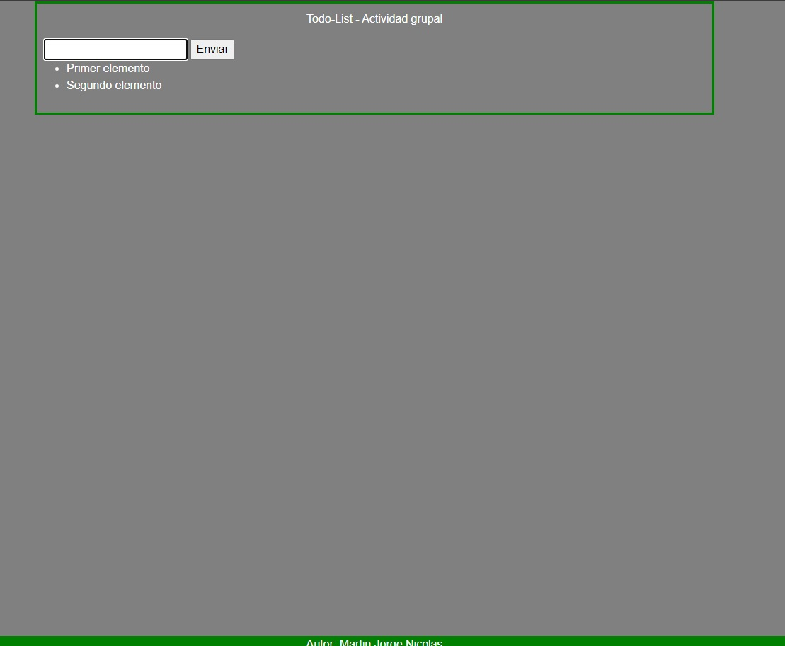

# Todo-List: Agregar listado - Actividad Grupal

## Descripcion del proyecto

- Es un simple proyecto que permite agregar items a un listado y eliminarlos haciendo click en el mismo. Tambien el listado queda guardado en el localstorage. Agreguen cualquier cosa que crean conveniente para mejorar, desde el README, funcionalidad o cambio del style.

## Ejecucion:

Para ejecutar el programa no hace falta instalar ninguna dependencia, solamente ejecutarlo utilizando la extension 'Live Server' en Visual Code.

## Languages ​​Used

- JavaScript, HTML and CSS.

## Autor

- Jorge Nicolas Martin
